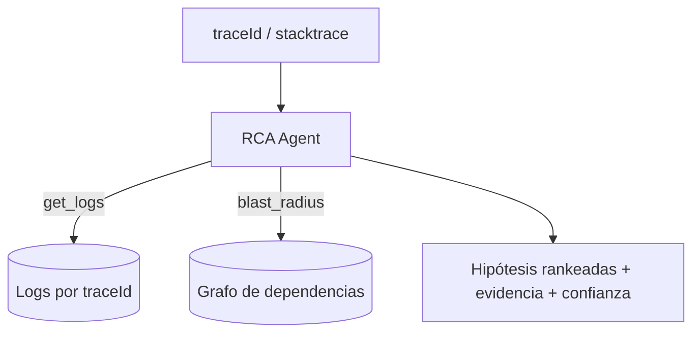

<p align="center">
<a href="https://www.linkedin.com/in/soriamaximilianorodrigo/" target="_blank" rel="noopener noreferrer">
</a>
</p>

<p align="center">
  
  
  
  
</p>

<p align="center">
  
</p>

<hr/>

<h1 align="center">ia-04-incident-rca-agent</h1>

<p align="center">
Agente de <b>causa raíz</b>: ante un stacktrace correlaciona logs, traza el blast radius sobre el grafo de dependencias y propone la causa — citando evidencia.
</p>

## ¿Qué resuelve este proyecto?

En un ecosistema de 9 servicios integrados, una falla rara vez es local: un timeout en `payment-service` puede originarse en `identity-service`. El agente recibe una señal (traceId/stacktrace) y produce un **informe de causa raíz**: servicios involucrados, blast radius calculado sobre el grafo real, cadena causal más probable y acciones — **todo citando la evidencia** (líneas de log, aristas del grafo) para que sea auditable.

## ¿Qué pasos sigue?

El agente sólo puede llamar herramientas acotadas (get_logs, blast_radius); identifica el error más *aguas arriba* y emite hipótesis rankeadas por confianza. Sin evidencia, no inventa causa.



## Componentes principales

- **`RcaAgent`** — loop de tool-calling determinista con presupuesto de evidencia.
- **`DependencyGraph`** — `blast_radius` = quién se ve afectado si un servicio cae.
- **`LogStore`** — logs correlacionados por `traceId`.
- **`Hypothesis`** — causa + confianza + blast radius + evidencia citada.

## ¿Por qué así?

El tool-calling acotado (el LLM elige herramientas, no ejecuta libre) lo hace **determinista y auditable** en vez de mágico. La regla dura —toda hipótesis cita evidencia, sin evidencia no se emite— evita alucinaciones de causa raíz.

## Uso

```bash
pip install -e ".[dev]"
pytest -q
```

> Parte del portafolio de **Maximiliano Rodrigo Soria** — capa de IA sobre el ecosistema
> de 9 backends. Corre **offline** (embedder por hashing + LLM stub deterministas);
> en producción se cambian los adaptadores por los reales (IA-07 local / API OpenAI-compatible)
> por los mismos puertos. Diseño y contrato completos en [`TASK.md`](./TASK.md).
