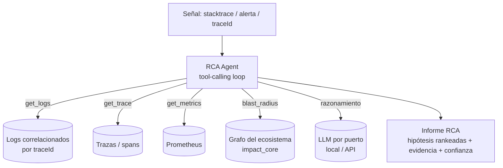

# IA-04 · Incident RCA Agent (causa raíz sobre el grafo de dependencias)

> Propuesta técnica independiente. Agente que, ante un stacktrace o alerta, correlaciona
> logs, traza el **blast radius** sobre tu grafo de dependencias y propone **causa raíz**.
> Fusiona la idea de `log-analysis-agent` + `analizar-impacto`.
> Estándar `base-api` (Java 21 + Spring Boot 4, hexagonal).

---

## 1. Contexto y objetivo

En un ecosistema de 9 servicios que se integran (P2 emite JWT para todos, P4 es
gateway de P5/P6/P7, P1 procesa jobs de varios, P8 es event-driven con Kafka), una
falla rara vez es local: un timeout en `payment-service` puede originarse en
`identity-service` o en el broker. Diagnosticar a mano exige saltar entre logs,
métricas y el mapa mental de quién depende de quién.

**Objetivo:** un agente que reciba una señal (stacktrace, alerta, traceId) y produzca
un **informe de causa raíz**: servicios involucrados, el *blast radius* calculado sobre
el grafo real del ecosistema, la cadena causal más probable y acciones sugeridas —todo
citando la evidencia (líneas de log, spans, aristas del grafo) para que sea auditable.

## 2. Alcance

**In:** ingesta de señal, recuperación de logs/trazas correlacionadas por traceId,
cálculo de blast radius sobre el grafo (reusa `analizar-impacto`/`impact_core`),
razonamiento del agente con herramientas (tool-calling), informe con evidencia y
nivel de confianza.

**Out:** auto-remediación (solo sugiere), instrumentación de los servicios (ya la
tienen: `MdcFilter`/traceId, Micrometer), alerting (se integra con el existente).

## 3. Decisiones arquitectónicas (trade-offs)

| Decisión | Elección | Trade-off |
|----------|----------|-----------|
| Patrón del agente | **Tool-calling** con herramientas acotadas (get_logs, get_trace, blast_radius, get_metrics) | Determinista y auditable vs agente libre; menos "mágico", más confiable |
| Fuente de verdad estructural | Grafo del ecosistema (`impact_core`) | Reusa lo que ya calculás; no reinventa dependencias |
| Correlación | Por `traceId` (ya presente vía `MdcFilter`) | Aprovecha tu observabilidad; sin instrumentar de nuevo |
| Salida | Hipótesis **rankeadas** con confianza + evidencia | Nunca afirma sin citar; el humano decide |
| LLM | Por puerto (local IA-07 / API) | Logs sensibles → puede correr 100% local |

## 4. Arquitectura



## 5. Stack por capa

- **Backend (JVM):** `rca-agent-service`, Java 21 + Spring Boot 4 hexagonal.
  `domain` (Incidente, Hipótesis, Evidencia), `application` (`DiagnoseIncidentUseCase`,
  el loop de herramientas), `infrastructure` (adaptadores a logs, Prometheus, grafo, LLM).
- **Herramientas del agente:** cada una es un `Port` con contrato estricto y validado;
  el LLM solo elige herramientas, no ejecuta libremente.
- **Grafo:** reusa `analizar-impacto`/`impact_core` de `mk5-toolkit` por puerto.
- **Resiliencia:** Resilience4j (timeouts, CircuitBreaker) sobre cada fuente externa.
- **Observabilidad:** el propio agente emite métricas (herramientas invocadas, iteraciones,
  latencia, tasa de RCA aceptadas por el humano).

## 6. Contrato

```
POST /v1/rca/diagnose
{ "traceId":"abc-123" }            # o { "stacktrace":"...", "service":"payment-service" }
→ 200 {
  "hypotheses":[
    { "rootCause":"identity-service: pool JWT agotado",
      "confidence":0.78,
      "blastRadius":["payment-service","api-gateway"],
      "evidence":[ {"type":"log","ref":"...","line":42}, {"type":"edge","ref":"payment→identity"} ] }
  ],
  "toolCalls": 6
}
```

## 7. Roadmap por fases

1. **F1 — Herramientas:** get_logs (por traceId), blast_radius (grafo), get_metrics.
   *DoD:* cada puerto testeado con datos reales/mocks.
2. **F2 — Loop del agente:** tool-calling con presupuesto de iteraciones y trazas del
   razonamiento. *DoD:* produce hipótesis con evidencia.
3. **F3 — Ranking y confianza:** score de hipótesis, verificación adversarial (¿la
   evidencia realmente la sostiene?). *DoD:* hipótesis ordenadas, sin afirmaciones sin cita.
4. **F4 — Integración:** disparo desde alertas/traceId; feedback humano (aceptada/no)
   para métricas de calidad.

## 8. Observabilidad, seguridad y testing

- **Seguridad:** logs suelen tener PII/secretos → enmascarado obligatorio (reusa
  `LogSanitizer` / `detectar-pii` / `detectar-secretos`); con IA-07, nada sale de la red.
- **Testing:** incidentes sintéticos con causa raíz conocida (golden set); test que
  verifica que **toda** hipótesis cita evidencia; ArchUnit; Testcontainers para fuentes.
- **Observabilidad:** herramientas invocadas, iteraciones por caso, tasa de aciertos.

## 9. Riesgos y mitigaciones

| Riesgo | Mitigación |
|--------|-----------|
| El agente alucina una causa | Toda hipótesis debe citar evidencia; sin evidencia → no se emite |
| Bucle infinito de herramientas | Presupuesto de iteraciones + timeout |
| Fuga de datos sensibles al LLM | Enmascarado previo + backend local (IA-07) |
| Sobre-confianza | Mostrar confianza calibrada y alternativas |

## 10. Definition of Done

- [ ] Herramientas acotadas (logs, trazas, métricas, blast radius) por puerto.
- [ ] Informe con hipótesis rankeadas, cada una con evidencia citada y confianza.
- [ ] Enmascarado de PII/secretos antes de llegar al LLM.
- [ ] Golden set de incidentes con causa conocida; tests verdes.
- [ ] Resilience4j sobre fuentes externas; ArchUnit y CI en verde.
